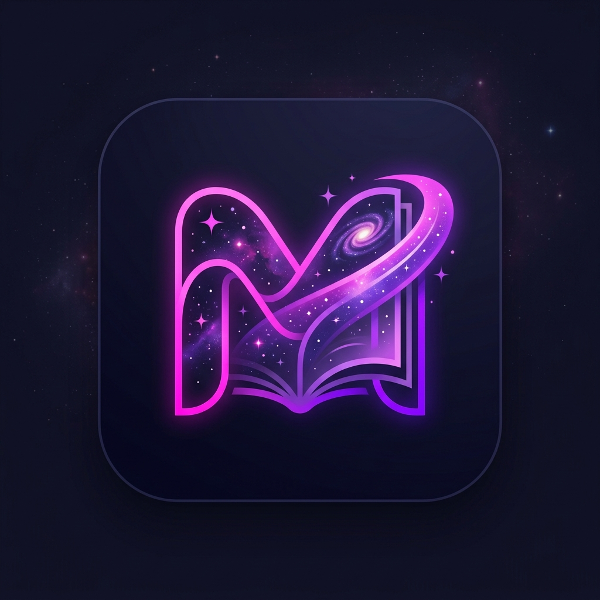

<div align="center">
  
  <h1>MangaVerse</h1>
  <p><strong>A premium, high-performance web application for reading manga, manhwa, and manhua.</strong></p>
  
  [](https://nextjs.org/)
  [](https://www.typescriptlang.org/)
  [](https://supabase.com/)
  [](https://upstash.com/)
  
  <br />
  <strong><a href="https://mangaverse-puce.vercel.app/">🚀 View Live Demo on Vercel</a></strong>
</div>

<br />

MangaVerse is a full-stack, responsive manga reader built with the **Next.js App Router**. It provides a seamless, ad-free reading experience with personalized libraries, cross-device reading history synchronization, and advanced community discovery tools.

## ✨ Features

- **Read Instantly**: Access thousands of titles via the **MangaDex API** with zero wait times and infinite scrolling chapter support.
- **Library Sync**: Sign in seamlessly with Google (NextAuth) to sync your bookmarks, reading progress, and library across all devices.
- **Advanced Discovery**: Filter by genre, demographic, format, and content rating to find your next favorite series.
- **Trending & Popular**: Integrates with the **AniList GraphQL API** to surface what the anime/manga community is reading right now.
- **Premium Aesthetics**: A sleek, dark-mode-first UI featuring glassmorphism, dynamic gradients, and smooth micro-animations.
- **Admin Dashboard**: Real-time analytics, user management, and platform engagement tracking powered by Postgres SQL RPCs and Upstash Redis.
- **High Performance**: Leverages Next.js static generation, React Server Components, and heavily optimized database queries to ensure instant load times.
- **Highly Secure**: Protected against bots with Global Edge Rate Limiting (Upstash), strictly enforced Content Security Policies (CSP), and Supabase Row Level Security (RLS).

## 🛠️ Tech Stack

- **Framework**: Next.js (App Router)
- **Language**: TypeScript
- **Styling**: Tailwind CSS & Vanilla CSS (Custom design tokens)
- **Authentication**: NextAuth.js (Auth.js v5 beta) with Google OAuth
- **Database**: Supabase (PostgreSQL with RLS & SQL RPCs)
- **Rate Limiting**: Upstash Redis (Global Edge caching and traffic shaping)
- **State Management**: Zustand (Client-side UI state), React Query (Data fetching)
- **APIs**: MangaDex REST API, AniList GraphQL API

## 🚀 Getting Started

### Prerequisites

- Node.js 18.x or later
- npm, yarn, or pnpm
- A Supabase Project (Database)
- An Upstash Redis Database (Rate limiting)
- Google OAuth Credentials (for NextAuth)

### Installation

1. **Clone the repository**
   ```bash
   git clone https://github.com/chamuwa1/mangaverse.git
   cd mangaverse
   ```

2. **Install dependencies**
   ```bash
   npm install
   ```

3. **Set up environment variables**
   Create a `.env.local` file in the root directory and add the following variables:
   ```env
   # NextAuth
   AUTH_SECRET="your-random-secret-key" # Run `npx auth secret` to generate
   AUTH_GOOGLE_ID="your-google-oauth-client-id"
   AUTH_GOOGLE_SECRET="your-google-oauth-client-secret"

   # Supabase
   NEXT_PUBLIC_SUPABASE_URL="https://your-project.supabase.co"
   NEXT_PUBLIC_SUPABASE_ANON_KEY="your-supabase-anon-key"
   SUPABASE_SERVICE_ROLE_KEY="your-supabase-service-role-key"

   # Upstash Redis (Rate Limiting)
   UPSTASH_REDIS_REST_URL="https://your-upstash-redis-url.upstash.io"
   UPSTASH_REDIS_REST_TOKEN="your-upstash-token"

   # Admin
   ADMIN_EMAIL="your-admin-email@gmail.com"
   ```

4. **Set up the Database**
   Copy the contents of `schema.sql` and run it in your **Supabase SQL Editor**. This will:
   - Create the `reading_history`, `bookmarks`, and `page_views` tables.
   - Set up strict Row Level Security (RLS) policies.
   - Register the Postgres RPCs (`get_admin_overview`, `get_daily_views`, etc.) needed for the Admin Dashboard.

5. **Run the development server**
   ```bash
   npm run dev
   ```

6. **Open [http://localhost:3000](http://localhost:3000)** in your browser to see the app.

## 🔐 Architecture & Security Guidelines

- **Server Actions**: All database mutations (bookmarking, updating history) are handled via Next.js Server Actions with strict session validation.
- **SQL RPCs**: Complex aggregations (admin analytics) bypass the ORM and use raw PostgreSQL Remote Procedure Calls to prevent Node.js memory exhaustion and unbounded table reads.
- **Data Fetching**: External APIs (MangaDex, AniList) are fetched using the native `fetch` API on the server side and cached according to Next.js data caching best practices.
- **Security**: 
  - Dynamic cryptographic Nonce generation for all inline scripts via Middleware.
  - Strict Content Security Policy (CSP) headers.
  - Supabase operations are restricted using RLS, ensuring users can only read/write their own data.
  - Per-IP rate limiting powered by Upstash Redis on the Edge.

## 🤝 Contributing

Contributions are welcome! Please ensure that your code adheres to the existing project structure. For major architecture changes, please open an issue first to discuss what you would like to change.

## 📄 License

This project is licensed under the MIT License.
